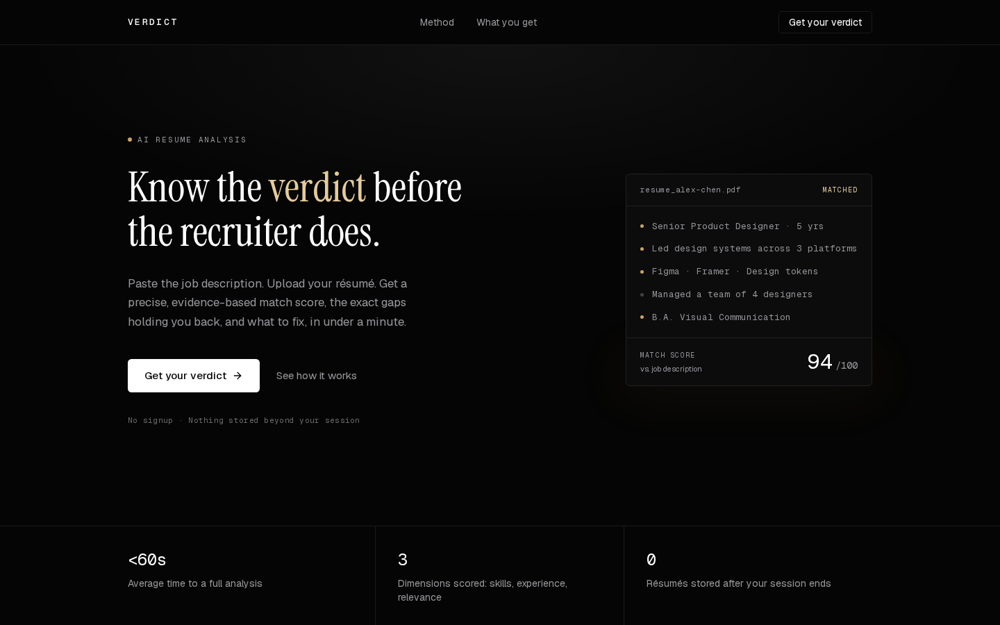
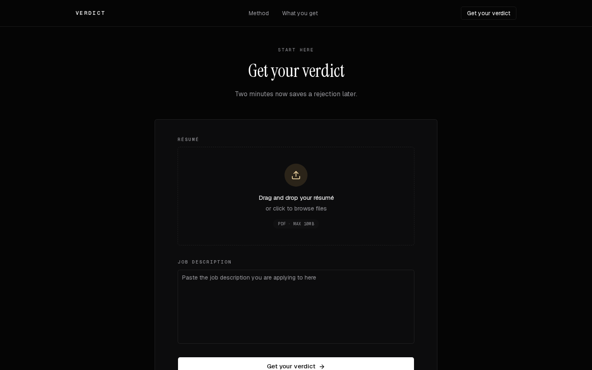
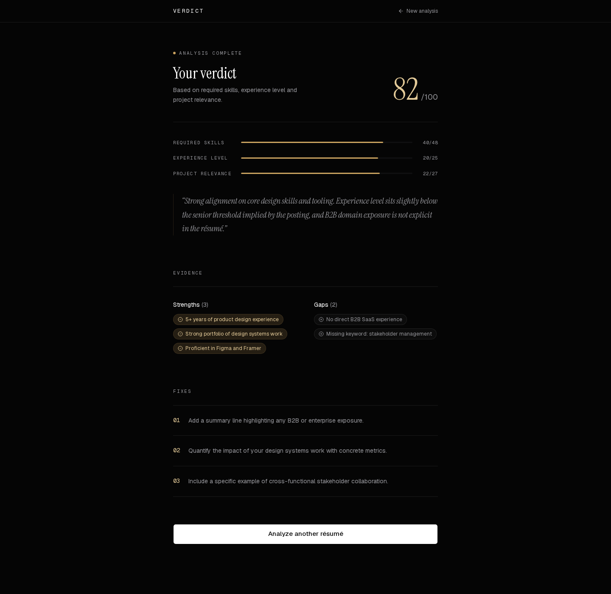

# Verdict — AI Résumé Analyzer

Know the verdict before the recruiter does. Paste a job description, upload a résumé, and get a precise, evidence-based match score instead of vague advice.



## What it does

Verdict analyzes a résumé against a specific job description and returns:

- **A match score out of 100**, broken down into required skills, experience level and project relevance — not a black-box number.
- **Strengths and gaps**, pulled directly from the résumé against the posting.
- **Ordered, concrete suggestions** for closing the gaps before resubmitting.

Nothing is stored beyond the session — no signup required.

## Screenshots

| Analyze | Verdict |
| --- | --- |
|  |  |

## Tech stack

- [Next.js 16](https://nextjs.org) (App Router, React 19, Turbopack)
- [TypeScript](https://www.typescriptlang.org/)
- [Tailwind CSS v4](https://tailwindcss.com/) with a custom dark, single-theme design system
- [shadcn/ui](https://ui.shadcn.com/) + [Radix UI](https://www.radix-ui.com/) primitives
- [TanStack Query](https://tanstack.com/query) for the analysis request lifecycle
- [React Hook Form](https://react-hook-form.com/) for the upload form
- [Zustand](https://zustand-demo.pmnd.rs/) (with persistence) for the analysis result store

## Getting started

### Prerequisites

- [Bun](https://bun.sh/) (this project uses `bun.lock`; npm/yarn/pnpm also work)
- A running instance of the analyzer API (see [Environment variables](#environment-variables))

### Install and run

```bash
bun install
bun dev
```

Open [http://localhost:3000](http://localhost:3000) to see the app.

### Environment variables

Create a `.env` file in `frontend/` (see `.env` for the value used locally):

```bash
NEXT_PUBLIC_API_URL=http://localhost:8000
```

The frontend expects the API to expose `POST {NEXT_PUBLIC_API_URL}/api/v1/analyze`, accepting `multipart/form-data` with a `resume_file` (PDF) and `job_description` field, and returning the analysis result consumed by the results page.

## Available scripts

| Command | Description |
| --- | --- |
| `bun dev` | Start the development server |
| `bun run build` | Create a production build |
| `bun run start` | Run the production build |
| `bun run lint` | Run ESLint |

## Project structure

```
src/
├─ app/
│  ├─ page.tsx              # Landing page (hero, method, features, analyze form)
│  ├─ results/[id]/page.tsx # Analysis results page
│  └─ globals.css           # Design tokens, fonts, keyframes
├─ components/
│  ├─ hero-section.tsx, method-section.tsx, features-section.tsx, ...
│  ├─ scan-visual.tsx       # Animated "résumé scan" signature element
│  ├─ file-upload-form.tsx  # Résumé upload + job description form
│  └─ ui/                   # shadcn/Radix-based primitives
├─ hooks/useAnalyzeMutation.ts
├─ store/analysisStore.ts   # Persisted analysis result state
└─ lib/                     # Types, validators, query client
```

## Design system

Verdict uses a fixed dark-luxury theme rather than a light/dark toggle: a matte black background, restrained typography (a serif display face paired with mono labels for data/eyebrows), hairline borders, and a single brass accent reserved for signature moments like the score and the scan animation.

## Learn more

- [Next.js Documentation](https://nextjs.org/docs)
- [Tailwind CSS Documentation](https://tailwindcss.com/docs)
- [shadcn/ui Documentation](https://ui.shadcn.com/docs)
